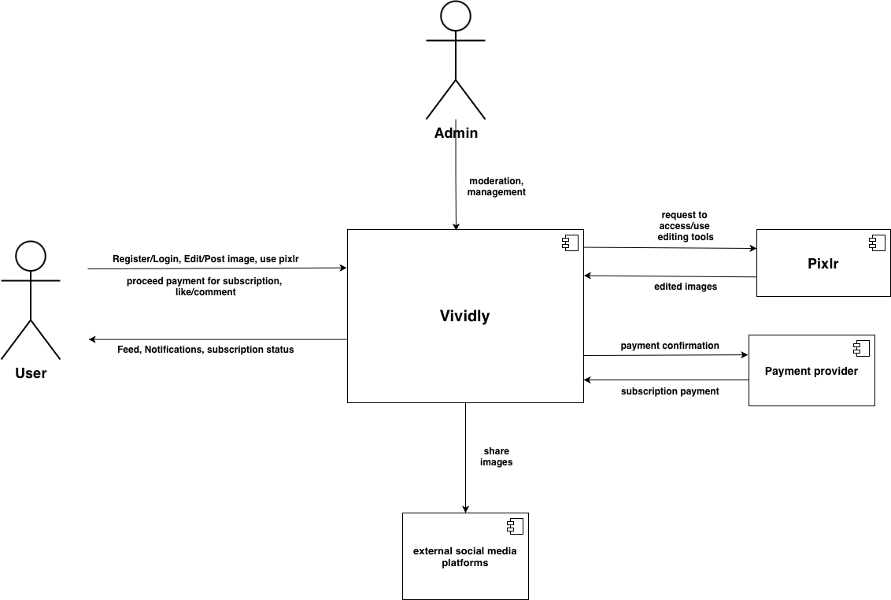
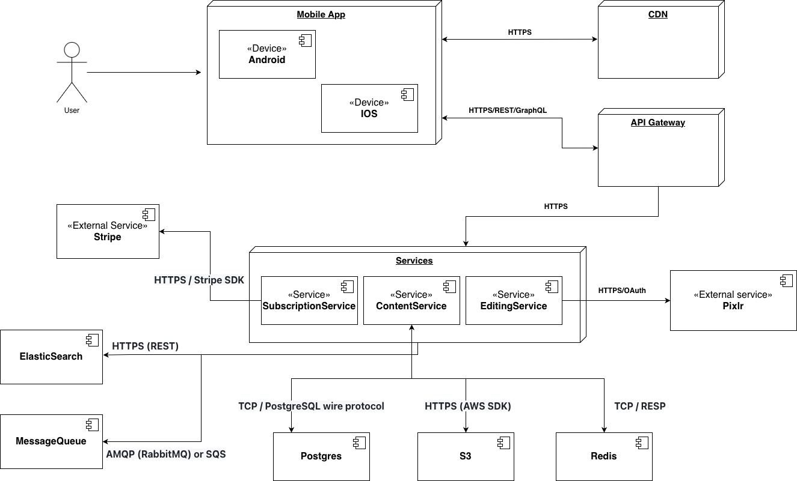

ifndef::imagesdir[:imagesdir: ../images]

[[section-context-and-scope]]
== Context and Scope

=== Vividly Business Context

==== User
A regular user uses *Vividly* to register, login, edit and post images, use Pixlr editing tools, proceed with payments for subscriptions, and interact through likes or comments. They also receive content feeds, notifications, and subscription status updates from the platform.

==== Admin
An administrator uses *Vividly* to perform moderation and management tasks across the platform.

==== Pixlr
*Vividly* sends requests to access and use image editing tools provided by *Pixlr*. In return, *Pixlr* sends the edited images back to *Vividly*.

==== Payment provider
*Vividly* sends payment confirmations to the *Payment provider*, which in turn processes and sends subscription payment statuses back to *Vividly*.

==== External social media platforms
*Vividly* interacts with *external social media platforms* to share images directly from the application.

=== Vividly Technical Context

*Vividly* is broken into multiple architectural components and services:

==== Mobile App
The client application runs natively on modern mobile platforms, encompassing both *Android* and *iOS* devices. The app communicates with the *CDN* over HTTPS to fetch static content and media efficiently, while executing business operations by sending HTTPS/REST/GraphQL requests directly through the *API Gateway*.

==== API Gateway & Services
The *API Gateway* acts as the single entry point, routing incoming client traffic over HTTPS to the core backend *Services*. The backend is modularized into dedicated domain services:
* *SubscriptionService*: Manages user memberships and payments, integrating with *Stripe* via HTTPS / Stripe SDK.
* *EditingService*: Handles image manipulation tasks, securely authenticating and communicating with *Pixlr* via HTTPS/OAuth.
* *ContentService*: Orchestrates core application data and feeds, dispatching events and offloading intensive tasks or search indexing.

==== Infrastructure & Data Management
The core services rely on a robust infrastructure layer for data persistence, messaging, and search capabilities:
* *Postgres*: Serving as the primary relational database, accessed via the TCP / PostgreSQL wire protocol.
* *S3*: Providing object storage for images and media, integrated via HTTPS (AWS SDK).
* *Redis*: Utilized for high-performance caching and in-memory data structures, communicating over TCP / RESP.
* *ElasticSearch*: Powers advanced search and indexing features, queried via HTTPS (REST).
* *MessageQueue*: Handles asynchronous communication and event-driven workflows, utilizing AMQP (RabbitMQ) or SQS.
 
