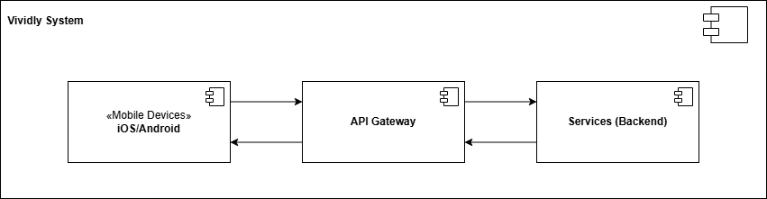
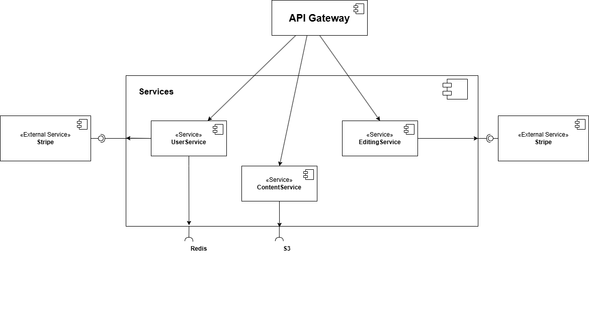

ifndef::imagesdir[:imagesdir: ../images]

[[section-building-block-view]]
== Building Block View

=== Level 1

All components depend on a central API Gateway routing mechanism, and backend services rely on a shared data access layer as well as asynchronous messaging infrastructure.
Contained blackboxes
[cols="1,2" options="header"]
|===
|Building Block |Responsibilities

|iOS/Android (Mobile Devices)
|The cross-platform client application providing the user interface for registrations, image uploads, feed interactions, and subscription management.

|API Gateway
|Acts as the single entry point for all client requests, handling routing, TLS termination, authentication checks, and rate limiting before traffic reaches the backend.

|Services (Backend)
|A service-oriented architecture encapsulating the entire core business logic, decoupled via an asynchronous message bus and split into domain-specific functional components.
|===

=== Level 2

The *Services* building block contains the core business logic of the system. It is decomposed into three services that handle user management, content delivery, and image editing, interacting with both internal data stores and external third-party APIs.

==== Contained Building Blocks

[cols="1,3", options="header"]
|===
| Building Block | Description

| *UserService*
| Manages user profiles, authentication, and subscription states. It interacts with Redis for fast data retrieval/session management and communicates with Stripe to handle user billing.

| *ContentService*
| Responsible for managing and serving application content. It connects directly to AWS S3 for asset storage and retrieval.

| *EditingService*
| Handles media and content editing workflows. It interfaces with Stripe, likely for processing transactional or usage-based feature limits.
|===

==== Important Interfaces

[cols="1,3", options="header"]
|===
| Interface | Description

| *API Gateway Integration*
| The central entry point that routes incoming external client requests directly to the internal services (`UserService`, `ContentService`, and `EditingService`).

| *Redis Interface*
| A data store interface utilized by `UserService` for caching or fast-access state tracking.

| *S3 Interface*
| An object storage interface utilized by `ContentService` to store and fetch static assets or media content.

| *Stripe (External Service)*
| External payment gateway integrated with both `UserService` (e.g., for subscriptions) and `EditingService` (e.g., for pay-per-use features).
|===

