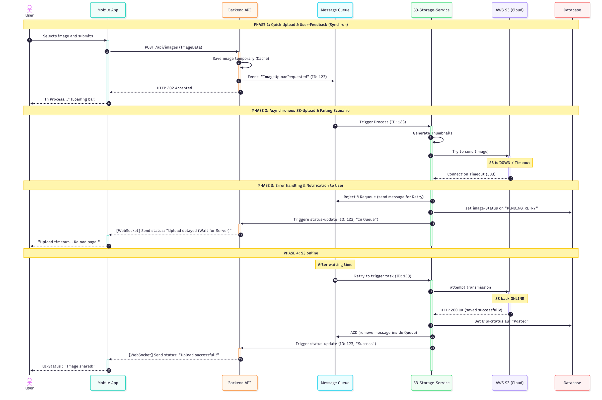
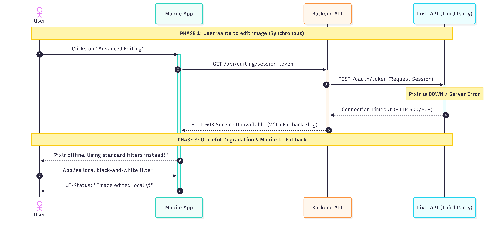

ifndef::imagesdir[:imagesdir: ../images]

[[section-runtime-view]]
== Runtime View

=== Upload image

This scenario describes how the system handles a standard image upload from a user and ensures resilience in case the cloud storage (AWS S3) is temporarily unavailable.

Explanation:

Phase 1: User uploads an image. Backend API caches it temporarily. API sends a message to the Queue. API immediately responds with HTTP 202.

Phase 2: Storage Service reads the queue message. Service generates thumbnails. Service tries to upload to AWS S3. S3 times out.

Phase 3: Service rejects the message to trigger a retry. Service sets database status to retry. Service sends a delay alert to the App via WebSockets.

Phase 4: Service waits and retries the task. S3 is back online and saves the image. Service acknowledges (ACK) and deletes the queue message. App receives a success alert via WebSockets.

=== Edit image
This scenario outlines the graceful degradation of the application's user interface when the external photo-editing service (Pixlr) suffers an unexpected outage.

Explanation:

User clicks on "Advanced Editing" within the Mobile App UI.

1. Mobile App sends a synchronous request (GET /api/editing/session-token) to the Backend API.

2. Backend API forwards the request (POST /oauth/token) to the external Pixlr API.

3. Pixlr API is down or experiences a server error, causing a connection timeout.

4. Backend API sends an HTTP 503 Service Unavailable response including a fallback flag back to the Mobile App.

5. Mobile App intercepts the 503 error code and bypasses the third-party framework interface.

6. Mobile App notifies the user that advanced tools are offline and offers standard filters instead.

7. User applies a local black-and-white filter, executing the image processing safely on the client side.

