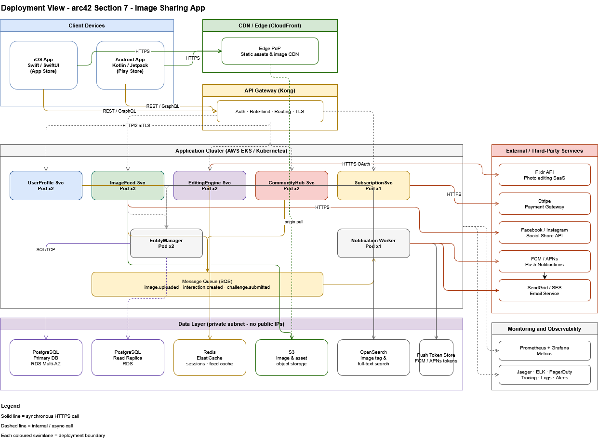

=== Deployment Diagram

=== Deployment Zones
 
[cols="2,4", options="header"]
|===
| Zone | Contents
 
| Client Devices
| iOS App (Swift / SwiftUI, distributed via App Store) and Android App (Kotlin / Jetpack Compose, distributed via Play Store).
 
| CDN / Edge (CloudFront)
| Global edge PoPs serving static assets (JS, fonts, app icons) and processed images. Origin pull from S3. Cache-Control headers set per asset type.
 
| API Gateway (Kong)
| Single entry point for all mobile API traffic. Responsibilities: JWT validation, rate limiting (per user and per IP), request routing to Kubernetes services, and TLS termination.
 
| Application Cluster (EKS / Kubernetes)
| Four coarse-grained SOA services, each exposing well-defined service contracts over REST. Services scale horizontally via auto-scaling policies based on observed load. *UserService* handles user profiles, authentication, and subscriptions. *ContentService* covers the image feed, uploads, community features, and social sharing. *EditingService* manages in-app editing tools, filters, and the Pixlr bridge. *NotificationService* handles push notifications and email delivery. All services share the EntityManager data access layer and communicate asynchronously via the shared service bus (SQS).
 
| Data Layer
a|
* PostgreSQL (Amazon RDS, Multi-AZ): primary write node + read replica; shared schema accessed by all services via EntityManager.
* Redis (ElastiCache, cluster mode): session store, feed cache, rate-limit counters.
* S3: image and asset object storage; versioning enabled; lifecycle policy archives originals to Glacier after 365 days.
* Elasticsearch (Amazon OpenSearch): image tag and full-text search index.
* SQS: managed message queues per event type (image.uploaded, interaction.created, challenge.submitted).
 
| External Services
| Pixlr API, Stripe, Facebook/Instagram Share API, FCM, APNs, SendGrid.
 
| Monitoring & Observability
| Prometheus + Grafana for metrics; Jaeger for distributed tracing; ELK stack for log aggregation; PagerDuty for alerting.
|===

 
=== Network Topology
 
All inter-service communication within the Kubernetes cluster uses mTLS enforced by a service mesh (Istio). Services are not reachable from outside the cluster except through the API Gateway. The data layer sits in a private subnet with no public IP addresses. S3 access is via VPC endpoint (no public internet traversal).
 
