== Quality Requirements
 
=== Quality Tree
 
The quality tree structures the top-level quality goals (from Section 1) into concrete sub-characteristics, each linked to the scenarios that make them measurable. Priority is indicated as *(H)* high, *(M)* medium, or *(L)* low.

 
[cols="1,1,2,1,1", options="header"]
|===
| Quality Goal | Priority | Sub-characteristic / Indicator | Scenario ref. | Section ref.
 
| Maintainability
| H
| Clean architecture and SOA decomposition keep modules loosely coupled; well-defined service contracts ease onboarding
| QS-06
| ADR-1
 
| Maintainability
| H
| Automated contract tests in CI/CD prevent breaking API changes
| —
| TD-04
 
| Operability
| H
| CI/CD pipeline automates build, test, and deployment; rolling deploys with zero downtime
| QS-06
| ADR-1
 
| Operability
| H
| Full observability via Prometheus, Jaeger, and ELK; PagerDuty alerting for on-call team
| —
| —
 
| Performance Efficiency
| H
| P95 feed response time < 500 ms under 10k concurrent users
| QS-01
| —
 
| Performance Efficiency
| H
| Image upload acknowledged < 3 s for 20 MB on 4G; derivatives ready < 10 s
| QS-02
| —
 
| Performance Efficiency
| M
| Images served from CloudFront CDN; cache hit ratio > 90%
| —
| R-02
 
| Usability
| M
| Intuitive UI/UX for all skill levels; new user registered and first image uploaded < 5 minutes
| —
| ADR-1
 
| Usability
| M
| Complex editing delegated to Pixlr behind a simple interface; core features reachable within 2 taps
| QS-07
| ADR-2
 
| Cost Efficiency
| M
| Managed cloud services (RDS, S3, EKS, SQS) avoid expensive in-house infrastructure
| —
| R-02
 
| Cost Efficiency
| M
| Editing outsourced to Pixlr; S3 lifecycle policy archives originals to Glacier after 365 days
| —
| ADR-2
 
| Security
| H
| HTTPS for all communication; JWT-based authentication; tokens expired after 15 min (access) / 30 days (refresh)
| QS-04
| TC_3
 
| Security
| H
| Passwords hashed with bcrypt; GDPR-compliant data handling; right-to-erasure completed within 72 hours
| QS-05
| TC_3
 
| Security
| M
| Stripe webhook idempotency prevents duplicate subscription activations
| —
| R-06
|===

=== Quality Scenarios
 
[cols="1,2,3,2", options="header"]
|===
| ID | Stimulus | Response | Measurable Target
 
| QS-01
| 10,000 concurrent users load the home feed simultaneously.
| The system serves feed responses without degradation.
| P95 feed response time < 500 ms; error rate < 0.1%.
 
| QS-02
| A user uploads a 20 MB HEIC image on a 4G connection.
| The image is uploaded, processed, and visible in the feed.
| Upload acknowledged < 3 s; processed derivatives available < 10 s.
 
| QS-03
| SubscriptionSvc becomes unavailable for 5 minutes.
| Existing users continue to access features; new subscriptions queue.
| No degradation for users with valid JWTs; new checkout returns 503 with retry-after header.
 
| QS-04
| A security researcher discovers a JWT without expiry is accepted.
| The system rejects expired or revoked tokens.
| Tokens older than 15 minutes (access) or 30 days (refresh) are rejected with HTTP 401.
 
| QS-05
| A user requests GDPR erasure.
| All personal data is removed or anonymised.
| Erasure completed within 72 hours; confirmation email sent; S3 objects deleted.
 
| QS-06
| A new filter type is added to EditingEngine.
| The change is deployed without downtime.
| Zero-downtime rolling deployment; no breaking changes to existing filter API contracts.
 
| QS-07
| The Pixlr API is unavailable.
| Users are informed and can use in-app editing tools.
| Circuit breaker opens within 30 s; user-facing error message displayed; in-app editor remains available.
|===
